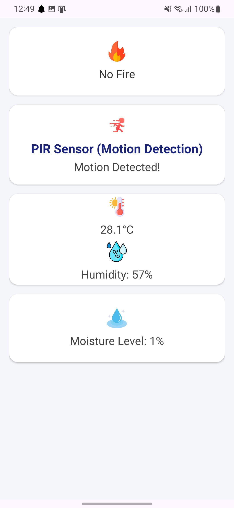
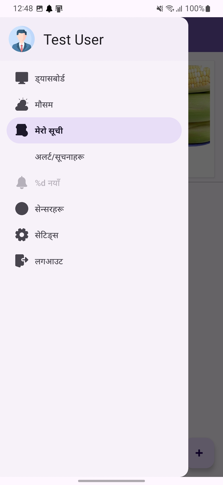
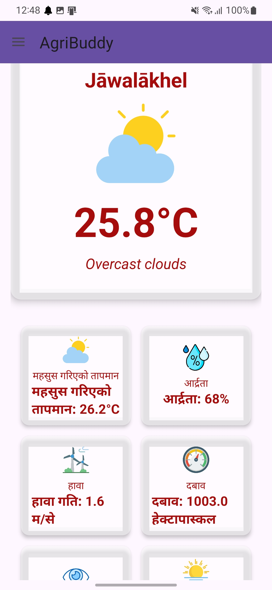
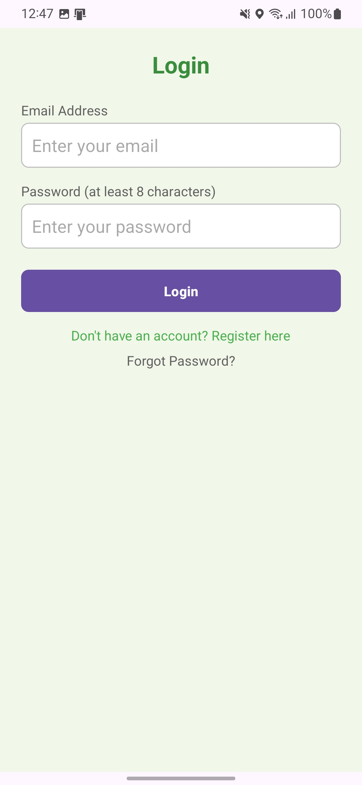
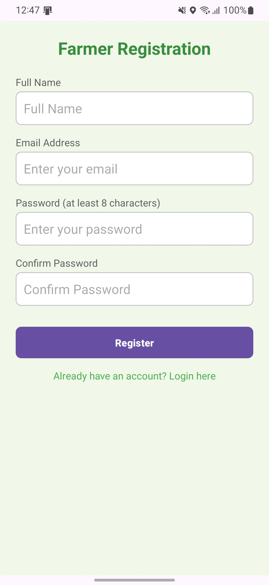

# AgriBuddy

AgriBuddy is an Android application designed to assist farmers and agricultural enthusiasts with real-time data on environmental conditions, crop management, and product tracking. It provides functionalities like sensor data integration (e.g., temperature and humidity), Firebase integration for data storage, and the ability to track and add agricultural products.

## Features

- **Real-time Sensor Data**: Displays real-time environmental data such as temperature and humidity.
- **Product Tracking**: Allows users to add, view, and manage agricultural products.
- **Firebase Integration**: Uses Firebase for cloud storage, database management, and real-time updates.
- **Push Notifications**: Integrated with Firebase Cloud Messaging (FCM) for notifications.
- **User-Friendly Interface**: Simple, easy-to-navigate UI to enhance user experience.

## Screenshots
Here are some snapshots of AgriBuddy in action:

<div>
  
  
  
  
  
</div>

## Technologies Used

- **Android**: Developed using Kotlin and Android SDK.
- **Firebase**: For real-time database and cloud storage.
- **Glide**: For image loading and displaying.
- **FCM**: For push notifications.

## Installation

### Prerequisites

- Android Studio (with the latest version of Android SDK)
- Firebase project setup (for Firebase Realtime Database and Firebase Cloud Messaging)
- Google Play Services

### Steps to Run Locally

1. **Clone the repository** to your local machine:
   ```bash
   git clone https://github.com/your-username/agribuddy.git
2. **Open the project** in Android Studio.
3. Setup Firebase:
   - Follow the Firebase setup guide for Android.
   - Add your **"google-services.json file"** to the project.
4. **Sync Gradle** and run the project on an emulator or device.

### Usage
1. **Add Product:** You can add agricultural products by filling out product details like name, price, and image.
2. **View Product:** Products are displayed with their details, including images, price, and description.
3. **Sensor Data:** Temperature and humidity data are fetched from sensors and displayed in real-time.


